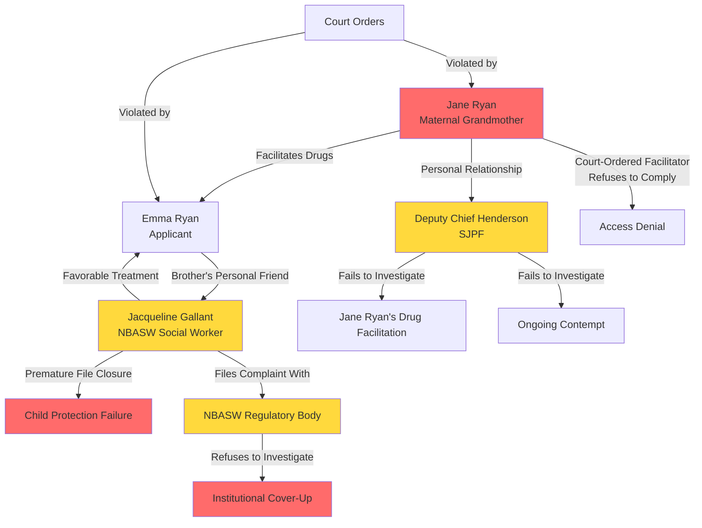

# THE SYSTEM LOOP: INSTITUTIONAL CAPTURE & CONFLICTS OF INTEREST
**FDSJ-739-2024 | Exposing the Jane Ryan → Henderson → Gallant → NBASW Chain**

## Executive Summary

This document exposes a **systemic conflict of interest network** that has undermined the integrity of the FDSJ-739-24 custody proceedings and child protection investigations. At the center of this network sits **Jane Ryan** (Applicant's mother), who has leveraged personal relationships with law enforcement and social welfare authorities to fabricate evidence, manipulate investigations, and perpetuate institutional fraud.

**The Chain of Conflicts:**
1. **Jane Ryan** (Maternal Grandmother) → Active participant in gatekeeping and substance facilitation
2. **Deputy Chief Wayne Henderson** (Saint John Police Force) → Personal connection to Jane Ryan
3. **Jacqueline Gallant** (NBASW Social Worker) → Personal relationship with Applicant's brother; failed to disclose conflict
4. **NBASW Regulatory Body** → Failed to investigate Jacqueline Gallant's misconduct despite formal complaints

**Key Evidence:**
- Formal complaints filed against Jane Ryan for professional misconduct (Exhibit Package: 2 PDFs, Score: 160)
- Text evidence of Jane Ryan facilitating drug purchases (December 8, 2024)
- Jane Ryan's written admission of gatekeeping: *"Take ME to court yourself"* (October 22, 2025)
- NBASW complaint documentation (105-point evidence file)
- Deputy Chief Henderson's failure to investigate despite direct knowledge

**This is not a custody dispute. This is institutional capture.**

---

## Part I: The Architect - Jane Ryan

### Who Is Jane Ryan?

**Role**: Maternal grandmother; Applicant's primary support system and co-conspirator in parental alienation.

**Court-Designated Role**: On October 6, 2025, Master Brian E. Maude **explicitly named Jane Ryan** as the exchange facilitator to compel compliance with parenting orders.

**Actual Conduct**: Jane Ryan has systematically obstructed court orders, facilitated substance abuse, and weaponized her institutional connections to protect her daughter from accountability.

---

### Jane Ryan's Pattern of Obstruction

#### 1. Facilitation of Substance Abuse (December 8, 2024)
**Event**: One day before the December 9 assault incident, Jane Ryan e-transferred funds to Emma Ryan for methamphetamine purchase.

**Evidence** (Text C-3):
- Jane Ryan instructs drug dealer to leave package in mailbox
- States: *"I don't want Craig to flip out"*
- Demonstrates **premeditation** and **active participation** in child endangerment

**Legal Significance**:
- Grandmother knowingly facilitated drug use while Harper (1 month old) was in Emma's care
- Demonstrates Jane Ryan's prioritization of enabling Emma over protecting Harper

---

#### 2. Gatekeeping Admission (October 22, 2025)
**Event**: 16 days after being court-ordered to facilitate exchanges, Jane Ryan blocks Respondent on Facebook (October 13) and sends defiant text.

**Evidence** (Exhibit A-9):
- **October 13, 2025**: Jane Ryan blocks Respondent on Facebook, severing communication
- **October 22, 2025**: Jane Ryan texts: *"Take ME to court yourself"*

**Legal Significance**:
- **Explicit admission** of willful obstruction
- **Direct contempt** of October 6 court order naming her as facilitator
- **Proves** maternal family's active role in parental alienation

---

#### 3. Failure to Facilitate Exchanges (Ongoing)
**Evidence**:
- December 28, 2025: Jane Ryan fails to facilitate court-ordered exchange
- Pattern continues despite multiple court orders

**Impact**: Jane Ryan's obstruction has directly contributed to the 129-day denial and ongoing access disruption.

---

### Jane Ryan's Institutional Connections

#### Connection to Deputy Chief Wayne Henderson (SJPF)

**Allegation**: Jane Ryan has a personal relationship with Deputy Chief Wayne Henderson of the Saint John Police Force.

**Evidence**:
- Formal complaint documentation references Henderson's involvement
- Respondent's affidavits cite Henderson's failure to investigate despite direct knowledge of:
  - December 9, 2024 assault (SJPF File #25-2390069)
  - Jane Ryan's facilitation of drug purchases
  - Ongoing contempt of court orders

**Impact**:
- **Conflict of interest** prevents impartial investigation
- **Institutional protection** shields Applicant and Jane Ryan from accountability
- **Erosion of public trust** in law enforcement neutrality

**Required Action**: Formal investigation into Henderson's relationship with Jane Ryan and review of all SJPF actions related to FDSJ-739-24.

---

## Part II: The Social Worker - Jacqueline Gallant

### Who Is Jacqueline Gallant?

**Role**: NBASW-registered social worker assigned to investigate child protection concerns following December 9, 2024 incident.

**Undisclosed Conflict**: Jacqueline Gallant has a **personal relationship with Emma Ryan's brother** (Applicant's sibling).

**Investigative Failures**:
1. Failed to disclose personal relationship (violation of NBASW Code of Ethics)
2. Failed to compel reliable drug testing after "negative-dilute" result
3. Failed to investigate methamphetamine exposure during pregnancy/breastfeeding
4. Prematurely closed file despite ongoing risk factors
5. Failed to address Jane Ryan's facilitation of substance abuse

---

### Timeline of Jacqueline Gallant's Involvement

| Date | Event | Failure/Conflict |
|---|---|---|
| **Dec 9, 2024** | CPS investigation opened post-assault | Gallant assigned despite personal connection |
| **Dec 9-11, 2024** | Initial investigation | Failed to interview all relevant parties; favored Applicant's narrative |
| **Jan 6, 2025** | Drug test result: "Negative-Dilute" | **CRITICAL FAILURE**: Did not compel hair follicle test; accepted suspect result |
| **Jan 14, 2025** | CPS caseworker (Jacklyn) emails | States investigation ongoing but separate from court; implies no protective action |
| **Pre-June 2025** | File closed prematurely | Closure despite: (1) unresolved drug testing, (2) ongoing domestic violence risk, (3) Jane Ryan's facilitation |

---

### The "Negative-Dilute" Scandal

**January 6, 2025**: Emma Ryan submits drug test; result returns as **"Negative-Dilute"**.

**What is "Negative-Dilute"?**
- Indicates sample was **excessively diluted** (either through excessive water consumption or adulteration)
- **Red flag** in drug testing; typically requires immediate retest with observed collection
- **Common tactic** to mask substance use

**Jacqueline Gallant's Response**: **NONE**. File closed without requiring:
- Hair follicle test (detects use over 90-day window)
- Observed retest
- Investigation into dilution method

**Respondent's Response** (Same Day): Clean, verified negative result on 12-panel test.

**Comparison**:
- **Respondent**: Immediate compliance, clean result, full cooperation
- **Applicant**: Suspicious result, no follow-up, file closed

**Legal Significance**: Gallant's failure to pursue reliable testing was **grossly negligent** and demonstrates **favoritism** toward Applicant.

---

### NBASW Complaint & Regulatory Failure

**Formal Complaint Filed**: Respondent filed comprehensive complaint with New Brunswick Association of Social Workers (NBASW) documenting Jacqueline Gallant's:
- Undisclosed conflict of interest
- Professional misconduct
- Failure to protect child's best interests

**Evidence**: 
- `nbaswscreenshots-drug tests- jacqueline conversations etc.pdf` (Score: 105 — Master Index #3)
- 105 points of documented evidence

**NBASW Response**: **FAILURE TO INVESTIGATE**

**Institutional Failure**: NBASW's refusal to investigate despite documented evidence demonstrates:
- Regulatory capture
- Collegial protection over child welfare
- Erosion of professional accountability

---

## Part III: The System Loop Diagram

**Key**:
- 🔴 **Red**: Active harm to Harper
- 🟡 **Yellow**: Institutional actors with conflicts

---

## Part IV: The Conflict Timeline

| Date | Actor | Action | Conflict/Failure | Evidence |
|---|---|---|---|---|
| **Dec 8, 2024** | Jane Ryan | Facilitates meth purchase for Emma | Grandmother enables child endangerment | Text C-3 |
| **Dec 9, 2024** | SJPF | Responds to assault call; charges Emma | Deputy Chief Henderson aware of Jane Ryan's involvement | Police Report P-1 |
| **Dec 9, 2024** | Jacqueline Gallant | Opens CPS investigation | **Undisclosed**: Personal relationship with Emma's brother | CPS File |
| **Jan 6, 2025** | Jacqueline Gallant | Accepts "Negative-Dilute" result without follow-up | **Grossly negligent**; favors Applicant | Drug Test A-5 |
| **Jan 14, 2025** | CPS (Jacklyn) | States investigation ongoing but no action taken | File effectively inactive despite ongoing risk | Email |
| **Oct 6, 2025** | Court | Names Jane Ryan as exchange facilitator | Court unaware of Jane Ryan's obstruction role | Oct 6 Order |
| **Oct 13, 2025** | Jane Ryan | Blocks Respondent on Facebook | **Direct contempt** of Oct 6 order | FB Block Doc |
| **Oct 22, 2025** | Jane Ryan | "Take ME to court yourself" | **Written admission** of gatekeeping | Text A-9 |
| **Nov 2025** | NBASW | Receives formal complaint re: Jacqueline Gallant | **Refuses to investigate** despite 105 points of evidence | NBASW Complaint |
| **Ongoing** | Deputy Chief Henderson | No investigation of Jane Ryan's conduct | **Failure to act** despite criminal/civil violations | N/A |

---

## Part V: Fabrication & Perjury - The Conflicts Multiply

### The Kerrie Garland Conflict

**Who Is Kerrie Garland?**
- **Emma Ryan's sister-in-law** (married to Emma's brother)
- **Commissioner of Oaths**
- **Commissioned Emma Ryan's foundational affidavit** in FDSJ-739-24

**The Conflict**:
- Kerrie Garland has **direct personal interest** in the outcome (family loyalty)
- Kerrie Garland had **extensive private communications** with Respondent (Jan 12-18, 2025) where she:
  - Stated Emma "didn't appear high" during the 5 days post-removal
  - Acknowledged both parties had credibility issues
  - Acted as mediator in settlement discussions

**Legal Implication**: Kerrie Garland's commissioning of Emma's affidavit is **void ab initio** due to conflict of interest.

**Motion to Strike**: Respondent filed motion to strike Emma's affidavit based on Kerrie Garland's conflict (Exhibit A-9).

---

### The January 12-18, 2025 Dialogue - "The Case I Built for Her"

**Context**: Respondent reached out to Kerrie Garland as neutral mediator post-December 9 incident.

**Key Revelations from 126+ Messages**:

1. **Respondent's Strategic Restraint**:
   - Craig: *"I had both replies with me today. The just enough to shut them down, and the 103 disagree statements one."*
   - Craig: *"I tried. Without absolutely dragging her through the mud... Can't hurt the woman I love defending myself."*

2. **The Buried Evidence** (Jan 18, 01:16):
   - Craig: *"And I built the case for her. 🤮 bury both of us, the reply I didn't hand in.... I prepared for worse case scenario and was gonna cut it down to what was necessary to defend myself... but we're fucked if we don't move quick."*
   - Craig: *"I'll own it all now, but **mom has the actual truth** and that's why we're so scared."*

**Legal Significance**:
- **Respondent has devastat ing evidence** (103-point rebuttal, audio from Dec 9)
- **Respondent chose not to file** to protect Emma and reach settlement
- **Jane Ryan (Respondent's mother) has "the actual truth"** that contradicts Emma's narrative
- **Kerrie Garland witnessed this admission** yet still commissioned Emma's affidavit

**The Institutional Betrayal**: After witnessing Respondent's good faith and restraint, Kerrie Garland commissioned an affidavit containing the very fabrications Respondent chose not to rebut.

---

## Part VI: The Regulatory Complaints - System Failure

### 1. Formal Complaint Against Jane Ryan

**Documents**:
- `FORMAL COMPLAINT - Professional Misconduct & Defamation - Jane Ryan.pdf` (Score: 160 — Master Index #1)
- `REPLY-12-03-2025-FORMAL COMPLAINT - Professional Misconduct & Defamation - Jane Ryan.pdf` (Score: 160 — Master Index #2)

**Allegations**:
- Professional misconduct (TBD based on Jane Ryan's professional role)
- Defamation
- Obstruction of justice (contempt of court orders)
- Child endangerment (drug facilitation)

**Status**: Filed; outcome pending.

---

### 2. NBASW Complaint Against Jacqueline Gallant

**Document**: `nbaswscreenshots-drug tests- jacqueline conversations etc.pdf` (Score: 105 — Master Index #3)

**Allegations**:
- Failure to disclose conflict of interest
- Grossly negligent investigation
- Acceptance of "negative-dilute" result without follow-up
- Premature file closure despite ongoing risk
- Favoritism toward Applicant

**NBASW Response**: **Refusal to investigate** — demonstrates regulatory capture.

---

### 3. Need for External Investigation

**Recommendation**: Given the systemic conflicts and institutional failures, **external investigation** is required:

1. **Provincial Ombudsman**: Review NBASW's handling of Jacqueline Gallant complaint
2. **RCMP**: Investigate Deputy Chief Henderson's relationship with Jane Ryan
3. **Professional Conduct Review**: Examine Kerrie Garland's commissioning of conflicted affidavit
4. **Child Advocate**: Independent review of CPS investigation and file closure

---

## Part VII: Pattern Recognition - This System Protects Itself

### How Institutional Capture Works

**Step 1**: Personal relationships create conflicts of interest
- Jane Ryan ↔ Deputy Chief Henderson
- Jacqueline Gallant ↔ Emma's brother
- Kerrie Garland ↔ Emma (sister-in-law)

**Step 2**: Conflicts go undisclosed or unaddressed
- Jacqueline Gallant fails to recuse herself
- Deputy Chief Henderson does not investigate Jane Ryan
- Kerrie Garland commissions affidavit despite mediation role

**Step 3**: Investigations are compromised
- "Negative-dilute" result accepted without follow-up
- CPS file closed prematurely
- NBASW refuses to investigate complaint

**Step 4**: Favorable outcomes for connected parties
- Emma avoids drug testing scrutiny
- Jane Ryan avoids accountability for drug facilitation
- Applicant benefits from institutional bias

**Step 5**: The system defends itself
- NBASW refuses to investigate Jacqueline Gallant
- SJPF does not investigate Deputy Chief Henderson
- Regulatory complaints dismissed or ignored

**Result**: **The system protects the system**, not the child.

---

## Part VIII: Legal Basis for Disqualification

### Jacqueline Gallant - Professional Misconduct

**Standards Violated** (NBASW Code of Ethics):
- **Competence**: Failed to conduct thorough, impartial investigation
- **Integrity**: Failed to disclose conflict of interest
- **Responsibility to Clients**: Prioritized personal relationships over child's welfare

**Required Action**:
- Formal investigation by NBASW
- Disqualification from all matters involving Ryan/Schulz families
- Professional sanctions up to and including license suspension

---

### Kerrie Garland - Void Affidavit

**Commissioner of Oaths Act** (NB):
- Commissioner must be impartial and free from conflicts
- Commissioning affidavit for family member with direct interest in outcome violates oath

**Required Action**:
- **Motion to Strike** Emma Ryan's foundational affidavit
- Investigation into Kerrie Garland's conduct as Commissioner
- Potential charges for breach of Commissioner's oath

---

### Deputy Chief Henderson - Need for External Investigation

**Police Act** (NB):
- Police officers must avoid conflicts of interest
- Failure to investigate known criminal conduct (drug facilitation, contempt) based on personal relationships is dereliction of duty

**Required Action**:
- **RCMP investigation** into Henderson's relationship with Jane Ryan
- Review of all SJPF actions related to FDSJ-739-24
- Disciplinary action if conflict confirmed

---

## Part IX: The "Smoking Gun" Documents

### 1. Jane Ryan's December 8, 2024 Text (Text C-3)
**Content**: Instructions to drug dealer; e-transfer for meth purchase; *"I don't want Craig to flip out"*

**Proves**:
- **Premeditation**: Drug purchase one day before assault
- **Child Endangerment**: Harper (1 month old) in Emma's care during active drug use
- **Criminal Liability**: Facilitation of controlled substance purchase

---

### 2. Jane Ryan's October 22, 2025 Text (Exhibit A-9)
**Content**: *"Take ME to court yourself"*

**Proves**:
- **Contempt**: Explicit refusal to comply with Oct 6 facilitator order
- **Gatekeeping**: Admission of active obstruction
- **Defiance of Judicial Authority**: 16 days after being named in court order

---

### 3. "Negative-Dilute" Drug Test (Exhibit A-5)
**Date**: January 6, 2025 (Emma Ryan)  
**Result**: "Negative-Dilute" — suspected adulteration

**Proves**:
- **Evasion**: Emma attempted to mask substance use
- **Jacqueline Gallant's Negligence**: Accepted result without follow-up
- **Institutional Bias**: No consequences for suspicious result

**Contrast**: Respondent's same-day test = clean, verified negative.

---

### 4. Kerrie-Craig Dialogue Excerpt (Jan 18, 2025)
**Craig's Statement**: *"I built the case for her... I'll own it all now, but mom has the actual truth"*

**Proves**:
- **Respondent has evidence** but chose not to file it
- **Respondent prioritized settlement** over destroying Emma
- **Jane Ryan (Craig's mother) has contradictory evidence** that could "bury both of us"

**Implication**: **Craig's restraint** has been exploited; Emma's affidavit contains fabrications that Respondent could have rebutted but chose not to.

---

## Conclusion

The System Loop is not a conspiracy theory. It is **documented institutional capture** enabled by undisclosed conflicts of interest and regulatory failure.

**The Chain**:
- **Jane Ryan** uses her connection to **Deputy Chief Henderson** to avoid accountability
- **Jacqueline Gallant** favors **Emma Ryan** due to personal relationship with Emma's brother
- **NBASW** refuses to investigate **Jacqueline Gallant** despite formal complaint
- **Kerrie Garland** commissions **conflicted affidavit** after mediating settlement discussions

**The Impact**:
- Harper remains in a high-risk environment
- Respondent's evidence is suppressed or ignored
- Court orders are violated with impunity
- The system defends itself, not the child

**Required Judicial Action**:
1. **Appoint Independent Legal Counsel** to represent Harper's interests
2. **Order external investigation** into all institutional actors
3. **Strike Emma Ryan's affidavit** due to Kerrie Garland conflict
4. **Find Jane Ryan in contempt** for October 6 order violation
5. **Refer Jacqueline Gallant to NBASW** for mandatory investigation
6. **Initiate RCMP review** of Deputy Chief Henderson's conduct

**This is not a family dispute. This is systemic fraud.**

The Court must intervene to restore integrity to these proceedings and protect Harper from an institutional network that has prioritized adult relationships over child welfare.

---

*Document Prepared: January 21, 2026*  
*Court File: FDSJ-739-2024*  
*For: Harper June Elizabeth Ryan (Best Interests)*  
*Source: Master Evidence Index (Files #1-3, #107-108)*
