# VISUAL TIMELINE - FDSJ-739-24
**Harper's Story: November 2024 - January 2026**

## Interactive Timeline (Mermaid Diagram)

```mermaid
timeline
    title Harper June Elizabeth Ryan - Custody Case Timeline
    
    section Birth & Early Violence (Nov-Dec 2024)
        Nov 8, 2024 : Emma admits drug use (4 days before birth)
        Nov 12, 2024 : Harper born (LOW BIRTH WEIGHT 2120g, NICU)
        Nov 19, 2024 : Emma assaults Craig (black eye)
        Nov 30, 2024 : Mirror assault + "Meth in breastmilk" text
        Dec 8, 2024 : Jane Ryan facilitates meth purchase
        Dec 9, 2024 : ASSAULT (Harper present) - Police charge Emma
    
    section Recovery & Settlement (Jan 2025)
        Jan 6, 2025 : Emma's "Negative-Dilute" drug test
        Jan 12-18, 2025 : Mediation (Craig-Kerrie) - Settlement reached
        Jan 14, 2025 : Interim Court Order (parenting schedule)
        Jan 31, 2025 : Craig's CLEAN drug test
    
    section February - May 2025
        Mar 22, 2025 : Further Interim Order (confirms Sunday access)
    
    section The 129-Day Denial (June-Oct 2025)
        June 4, 2025 : Access denial begins (First Sunday denied)
        June 15, 2025 : FATHER'S DAY DENIED
        June 18, 2025 : SMOKING GUN EMAIL - "Won't see Harper until October"
        June 22-Oct 5, 2025 : 16 MORE SUNDAYS DENIED (18 total)
        Sept 21, 2025 : Crown CHARGES Emma with Assault
        Oct 6, 2025 : Court Order - Names Jane Ryan as facilitator
        Oct 7-10, 2025 : Violation of NEW order (4 days)
        Oct 10, 2025 : Access finally restored (129 days total)
    
    section Post-Denial Obstruction (Oct-Dec 2025)
        Oct 13, 2025 : Jane Ryan blocks Craig on Facebook
        Oct 22, 2025 : Jane Ryan text - "Take ME to court yourself"
        Nov 12, 2025 : Harper's 1st Birthday (access obstructed)
        Dec 25, 2025 : Christmas DENIED
        Dec 28, 2025 : Jane Ryan fails to facilitate exchange
    
    section Present (Jan 2026)
        Jan 21, 2026 : Complete evidence package ready for filing
```



---

## Vertical Timeline (For Printing)

### 2024 - The Foundation

**November 8, 2024** 🚩  
Emma admits drug use (4 days before giving birth)  
📎 *Evidence: Text exhibit*

**November 12, 2024** 👶  
**HARPER BORN**  
- LOW BIRTH WEIGHT: 2120g (4 lbs 11 oz)  
- NICU admission (jaundice, breathing observations)  
📎 *Evidence: Hospital records*

**November 19, 2024** 🤕  
Emma gives Craig black eye (first assault)  
📎 *Evidence: Photo A-75*

**November 30, 2024** 🪞💊  
- Emma assaults Craig with glass mirror (Matt witnesses)  
- Emma texts: **"Meth in breastmilk"** (Harper 18 days old)  
📎 *Evidence: Video; Text A-11*

**December 8, 2024** 💸  
Jane Ryan e-transfers funds to Emma for meth purchase  
Text: *"I don't want Craig to flip out"*  
📎 *Evidence: Text C-3*

**December 9, 2024** ⚡ **CRITICAL INCIDENT**  
- 6-7 AM: Meth-filled apartment  
- Emma assaults Craig while he holds Harper  
- Emma screams: **"Where's my drugs?!"**  
- Police called, Emma CHARGED with assault  
- Craig removes Harper (discovers severe diaper rash)  
- CPS investigation opens  
- Craig drug test: **NEGATIVE (Clean)**  
📎 *Evidence: 1.4GB video, Police Report P-1 (SJPF File #25-2390069), Screenshot A-87, Photo A-6*

---

### 2025 - Settlement, Then Betrayal

**January 6, 2025** 🧪  
Emma's drug test: **"Negative-Dilute"** (suspected adulteration)  
Jacqueline Gallant accepts result without follow-up  
📎 *Evidence: Exhibit A-5*

**January 12-18, 2025** 🤝  
Craig-Kerrie Garland mediation (126+ messages)  
- Craig reveals 103-point rebuttal but won't file it  
- Craig: *"I built the case for her... I'll own it all"*  
- Settlement reached (Jan 18)  
📎 *Evidence: Conversation logs*

**January 14, 2025** ⚖️  
Interim Court Order issued (parenting schedule established)  
📎 *Evidence: Court order*

**January 31, 2025** ✅  
Craig's drug test: **NEGATIVE (Clean)** - ongoing sobriety verified  
📎 *Evidence: Test result*

**March 22, 2025** ⚖️  
Further Interim Order (confirms Sunday parenting time 8 AM - 4 PM)  
📎 *Evidence: Court order*

**June 4, 2025** ⛔ **THE 129-DAY DENIAL BEGINS**  
First Sunday denied  
📎 *Evidence: Access Denial Calendar A-8*

**June 15, 2025** 🎁❌  
**FATHER'S DAY DENIED**  
📎 *Evidence: Calendar A-8*

**June 18, 2025** 📧 **SMOKING GUN**  
Emma's email: **"You will not see Harper until we see a judge in October"**  
📎 *Evidence: Exhibit A-8 - Written confession of contempt*

**June 22 - October 5, 2025** ⛔⛔⛔  
**16 MORE CONSECUTIVE SUNDAYS DENIED** (Sundays #3-#18)  
- Every Sunday: Craig arrives, is denied  
- Text logs, call logs, photo timestamps document all attempts  
📎 *Evidence: Exhibits A-66 through A-75; Calendar A-8*

**September 21, 2025** 👮⚖️  
**Crown formally CHARGES Emma with Assault** (for Dec 9, 2024)  
📎 *Evidence: Criminal charge documentation*

**October 6, 2025** ⚖️  
Court issues **Further Interim Order**  
- Reaffirms Sunday parenting time  
- Explicitly names **Jane Ryan** as exchange facilitator  
📎 *Evidence: Oct 6, 2025 court order*

**October 7-10, 2025** ⛔⚖️  
**VIOLATION OF FRESH COURT ORDER**  
Emma continues denial for 4 more days despite Oct 6 order naming Jane as facilitator  
📎 *Evidence: Access denial calendar*

**October 10, 2025** ✋  
**ACCESS FINALLY RESTORED**  
**Total denial: 129 consecutive days (42% of Harper's first year)**  
📎 *Evidence: Access denial calendar*

**October 13, 2025** 📱🚫  
Jane Ryan blocks Craig on Facebook (7 days after being named facilitator)  
📎 *Evidence: FB block documentation*

**October 22, 2025** 📱💬  
Jane Ryan texts Craig: **"Take ME to court yourself"**  
📎 *Evidence: Exhibit A-9 - Admission of gatekeeping*

**November 12, 2025** 🎂  
**Harper's 1st Birthday** - Access obstructed by maternal family  
📎 *Evidence: Communication logs*

**December 25, 2025** 🎄❌  
**Christmas DENIED**  
📎 *Evidence: Calendar*

**December 28, 2025** ⛔  
Jane Ryan fails to facilitate court-ordered exchange  
📎 *Evidence: Documentation*

---

### 2026 - Truth Prepared

**January 21, 2026** 📁✅  
**COMPLETE EVIDENCE PACKAGE READY FOR FILING**  
- 16 comprehensive documents (~300 pages)  
- 300 prioritized exhibits (Master Index)  
- 1.4GB video evidence  
- Motion templates ready  
- 3 days ahead of 5-day deadline  

---

## Key Statistics

| Metric | Value |
|---|---|
| **Total Denial Period** | 129 consecutive days |
| **Denied Sundays** | 18 Sundays |
| **Lost Parenting Hours** | 144 hours minimum |
| **Percentage of First Year Lost** | 42% (129/306 days from Nov 12, 2024 to Oct 10, 2025) |
| **Communication Blackout** | 36 days (Sept 5 - Oct 10, 2025) |
| **Harper's Age During Denial** | 6 months to 10.9 months (CRITICAL ATTACHMENT PERIOD) |

---

## Color-Coded Event Categories

🚩 **Red Flag**: Substance use, violence, endangerment  
👶 **Harper**: Events directly affecting Harper  
⚖️ **Court**: Official court actions/orders  
⛔ **Access Denial**: Denied parenting time  
✅ **Positive**: Craig's responsible actions  
📧 **Communication**: Key text/email evidence  
👮 **Legal System**: Police, criminal charges  

---

## Pattern Analysis

### Violence Escalation Pattern
```
Nov 19: Black eye (fists)
    ↓
Nov 30: Mirror assault (weapon)
    ↓
Unknown: Knife incident (deadly weapon)
    ↓
Dec 9: Assault with rod/bottle (Harper present) → POLICE CHARGE
```

### Contempt Escalation Pattern
```
June 18: Written admission ("won't see Harper until October")
    ↓
June 4 - Oct 5: 18 consecutive denied Sundays
    ↓
Oct 6: Court issues FRESH ORDER naming Jane as facilitator
    ↓
Oct 7-10: Violates FRESH ORDER within 4 days
    ↓
Oct 22: Jane Ryan admits gatekeeping ("Take ME to court")
```

### System Failure Pattern
```
Dec 9: CPS opens investigation (Jacqueline Gallant assigned)
    ↓
Jan 6: Emma's "Negative-Dilute" test → Gallant accepts WITHOUT follow-up
    ↓
Pre-June 2025: CPS file closed prematurely
    ↓
NBASW Complaint filed against Gallant (105 points)
    ↓
NBASW REFUSES TO INVESTIGATE
```

---

## Critical Dates for Court (Memorize)

**December 9, 2024** - Assault (1.4GB video proof)  
**June 18, 2025** - Smoking gun email  
**September 21, 2025** - Criminal charge validates Craig's account  
**October 6, 2025** - Fresh court order (immediately violated)

---

## Timeline Usage

**For Opening Statement**: Refer to color-coded version highlighting escalation  
**For Cross-Examination**: Use to impeach Emma's timeline claims  
**For Closing Argument**: Show pattern of contempt escalation  
**For Exhibits**: Print as reference during testimony

---

*Visual Timeline Created: January 21, 2026*  
*FDSJ-739-2024*  
*For: Harper June Elizabeth Ryan (Best Interests)*
